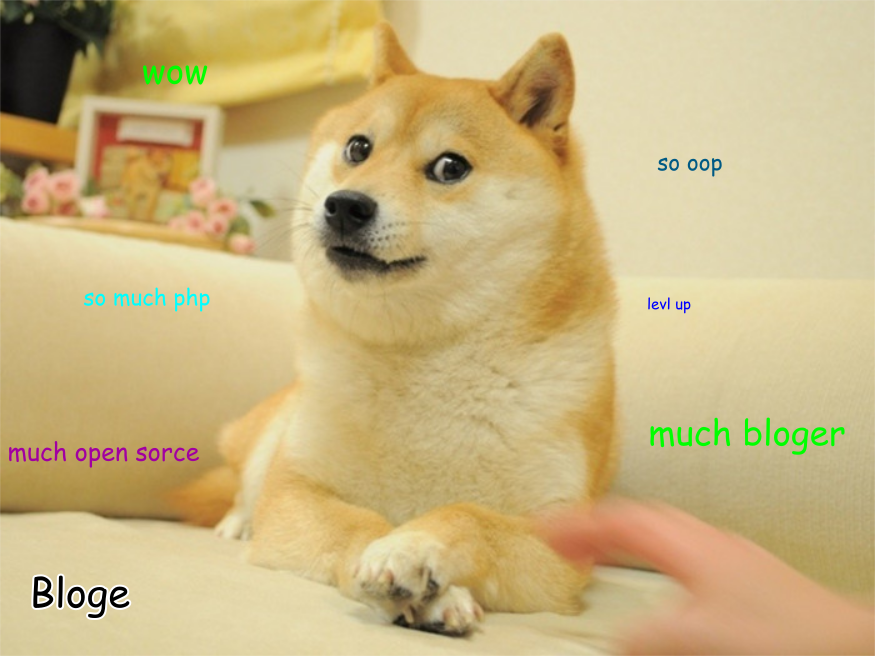

# Bloge

> Wow. So bloge. Much php.

## About

So... Bloge is another open source static website generator. Inspired by 
[metalsmith](https://github.com/segmentio/metalsmith). Bloge is focused on 
simplicity, flexibility and elegance of API (just like doge).

P.S.: temporary upload on bitbucket

## Example

Simple website with Bloge:

    // app.php
    
    use Bloge\Basic\App;
    use Bloge\Basic\Content;
    use Bloge\Basic\Renderer;
    
    $app = new App(
        new Content(__DIR__ . '/content'),
        new Renderer(__DIR__ . '/theme')
    );
    
    return $app;
    
    // index.php
    
    require 'vendor/autoload.php';
    
    $app = require 'app.php';
    
    try {
        echo $app->render($_GET['route']);
    } catch (Bloge\FileNotFoundException $e) {
        echo $app->render('404');
    }
    
And to build it down to static HTML website:

    $ mkdir build
    
    $ php vendor/bin/bloge app.php build

## Features

* Simple and flexible API
* Compile your website to static HTML
* Content route aliases, maps and ignores
* Content processing

## Getting started

To start with Bloge you need:

* PHP 5.4 or higher
* Terminal (CLI PHP)
* Composer

Next thing you want to do is to install `bloge/starter-pack` via composer 
somewhere on webserver:

    $ composer create-project bloge/starter-pack

In current directory will be created Bloge starter pack website. You can 
explore its source code and read manual provided by this starter pack.

## License

MIT license

    Copyright (c) 2015 volter9 <volter925@gmail.com>

    Permission is hereby granted, free of charge, to any person obtaining a copy
    of this software and associated documentation files (the "Software"), to deal
    in the Software without restriction, including without limitation the rights
    to use, copy, modify, merge, publish, distribute, sublicense, and/or sell
    copies of the Software, and to permit persons to whom the Software is
    furnished to do so, subject to the following conditions:

    The above copyright notice and this permission notice shall be included in
    all copies or substantial portions of the Software.

    THE SOFTWARE IS PROVIDED "AS IS", WITHOUT WARRANTY OF ANY KIND, EXPRESS OR
    IMPLIED, INCLUDING BUT NOT LIMITED TO THE WARRANTIES OF MERCHANTABILITY,
    FITNESS FOR A PARTICULAR PURPOSE AND NONINFRINGEMENT.  IN NO EVENT SHALL THE
    AUTHORS OR COPYRIGHT HOLDERS BE LIABLE FOR ANY CLAIM, DAMAGES OR OTHER
    LIABILITY, WHETHER IN AN ACTION OF CONTRACT, TORT OR OTHERWISE, ARISING FROM,
    OUT OF OR IN CONNECTION WITH THE SOFTWARE OR THE USE OR OTHER DEALINGS IN
    THE SOFTWARE.